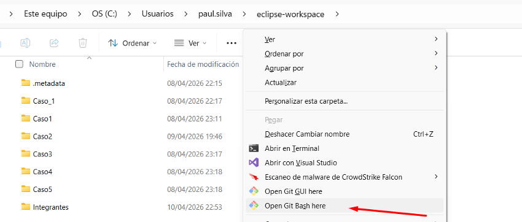
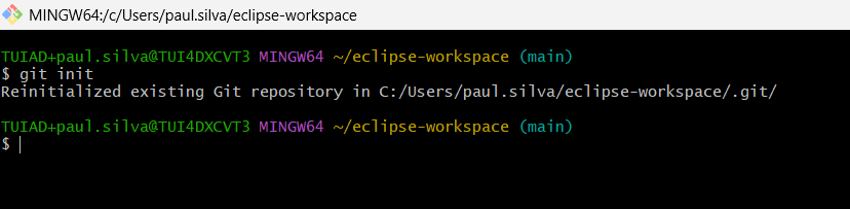
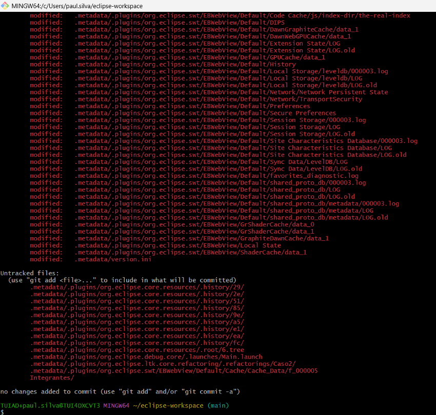
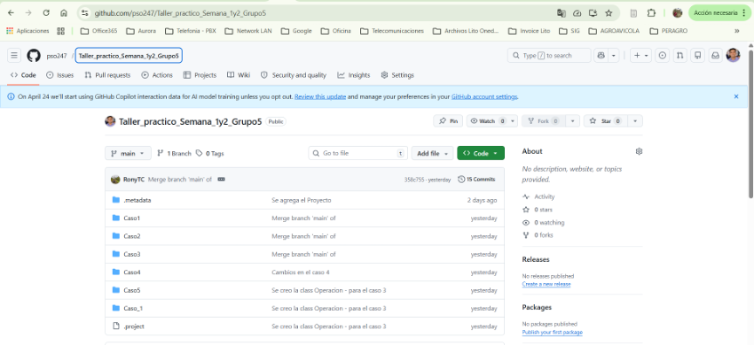
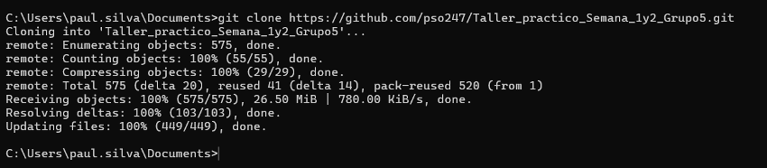
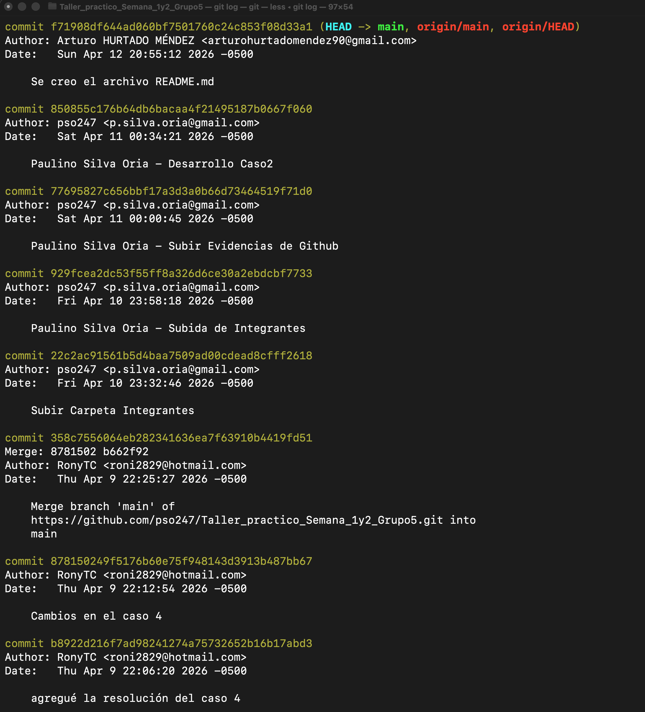
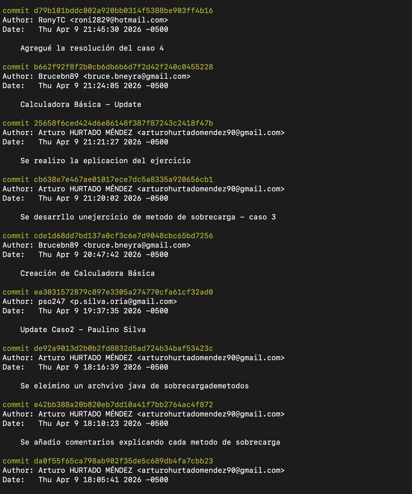
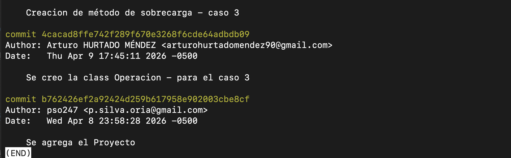

# Taller_practico_Semana_1y2_Grupo5
## Integrantes 
|Nombres| codigo| ID GitHub|
|-------|--------|---------|
|1. Bruce Barrera Neyra|N00439177| [Brucebn89](https://github.com/Brucebn89)|
|2. Rony Trigoso Chuan|N00427870|	[RonyTC](https://github.com/RonyTC)|
|3. Arturo Hurtado Mendez|N00438882|[Artur0HM90](https://github.com/Artur0HM90)|
|4. Carlos Garcia Bazan|N00403695| 	git: |
|5. Paulino Silva Oria|N00146614|[pso247](https://github.com/pso247)|

## Subida de proyecto a Github: Grupo 5

### git init: Inicializa el repositorio local.

### git status: Muestra el estado actual.

### git add .: Prepara todos los archivos dentro de la carpeta.

### git commit -m "Subiendo carpeta": Confirma los cambios con un mensaje.

### git remote add origin [https://github.com/pso247/Taller_practico_Semana_1y2_Grupo5.git](https://github.com/pso247/Taller_practico_Semana_1y2_Grupo5.git) Conecta con el repositorio en GitHub.

### git push -u origin main: Sube los archivos a la rama main

### Clonar repositorio:

### git clone [https://github.com/pso247/Taller_practico_Semana_1y2_Grupo5.git](https://github.com/pso247/Taller_practico_Semana_1y2_Grupo5.git)

### git log (sirve para ver el historial de cambios (commits) de tu proyecto en Git.)

